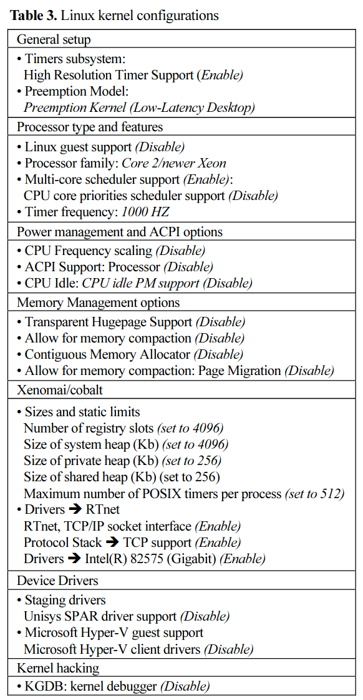

# Installation

Xenomai 3 Patch 관련 기록 저장용


설치에 사용된 환경:

- Intel i7-12700, DDR4 32GB
- Ubuntu 20.04.05 LTS
- Linux Kernel version 5.4.102
- Xenomai 3.1 stable
- I-pipe version 5.4.102
- gcc version 9.4.0 (Ubuntu 9.4.0-1ubuntu1~20.04.1)

1. 커널 빌드에 필요한 라이브러리 및 패키지를 미리 설치

```bash
sudo apt install build-essential git libssl-dev libncurses-dev kernel-package bison flex libelf-dev -y
```

2. 원본 리눅스 커널과 ipipe 패치를 다운로드

```bash
mkdir ~/kernel
cd ~/kernel

wget https://cdn.kernel.org/pub/linux/kernel/v5.x/linux-5.4.102.tar.xz
tar -xvf linux-5.4.102.tar.xz

wget https://xenomai.org/downloads/ipipe/v5.x/x86/ipipe-core-5.4.102-x86-3.patch

ipipe=~/kernel/ipipe-core-5.4.102-x86-3.patch
linux_tree=~/kerenl/linux-5.4.102
```

3. xenomai 프로젝트 저장소 클론 후, 3.1.x 브랜치로 변경 

```bash
cd ~
git clone https://source.denx.de/Xenomai/xenomai.git
cd xenomai

git checkout stable/v3.1.x
cd ..

xenomai_root=~/xenomai
```

4. 패치 실행 
    
```bash
cd $linux_tree
$xenomai_root/scripts/prepare-kernel.sh --arch=x86_64 --ipipe=$ipipe

make menuconfig 
```

menuconfig에서 다음과 같이 설정:

 1)

_만약 `EFI Handover` 에러가 발생하면 참조 할 것 2):_
```bash
Power management and ACPI options ----------------------->
ACPI (Advanced Configuration and Power Interface) Support --> on

Processor type and features ----------------------->
ACPI NUMA detection -> on
EFI runtime service support -> on
EFI stub support -> on
EFI mixed-mode support-> on
```
    
5. 빌드 및 설치

빌드:
```bash
sudo make-kpkg --j 20 --initrd --revision=1.0 --append-to-version -xenomai3.1 kernel_image kernel_headers
```

설치:
```bash
cd ..
sudo dpkg -i linux-image-5.4.102-xenomai3.1_1.0_amd64.deb
sudo dpkg -i linux-headers-5.4.102-xenomai3.1_1.0_amd64.deb

```


## Citation

1) 강성진. (2021). 실시간 EtherCAT 마스터 구현에 관한 연구. 반도체디스플레이기술학회지, 20(2), 131-136.
2) [基于Ubuntu18.04.5的xenomai3.x移植](https://blog.csdn.net/weixin_44322080/article/details/114941418)